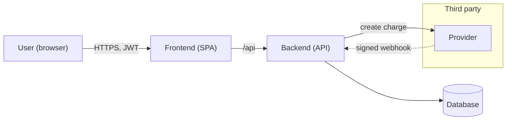
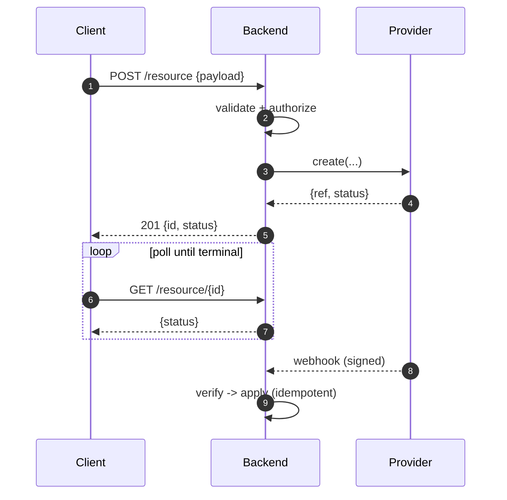
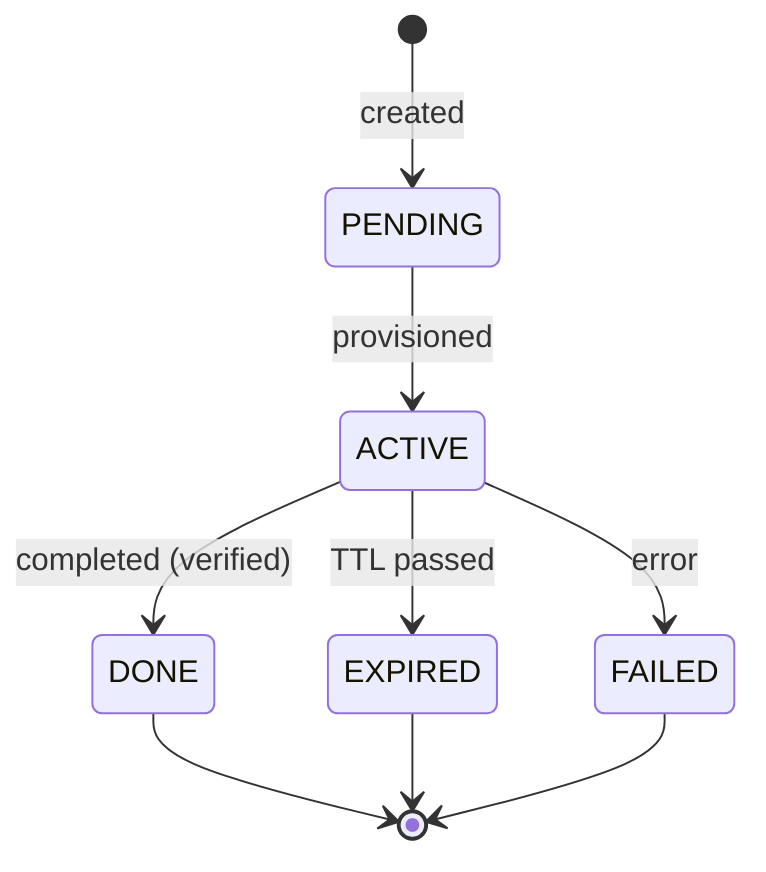
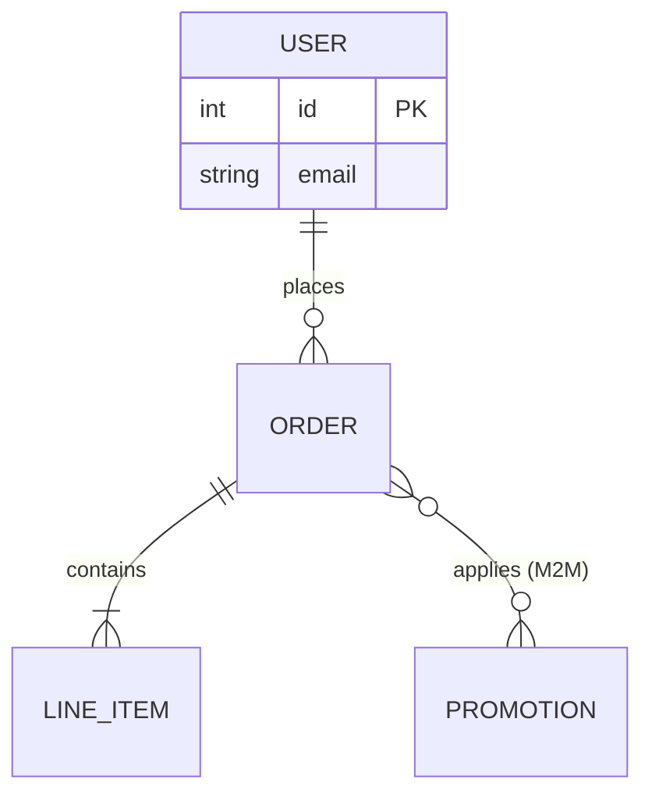
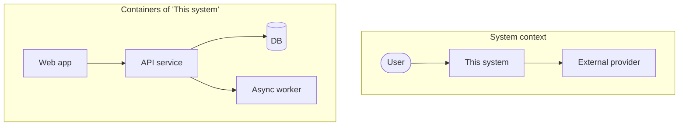
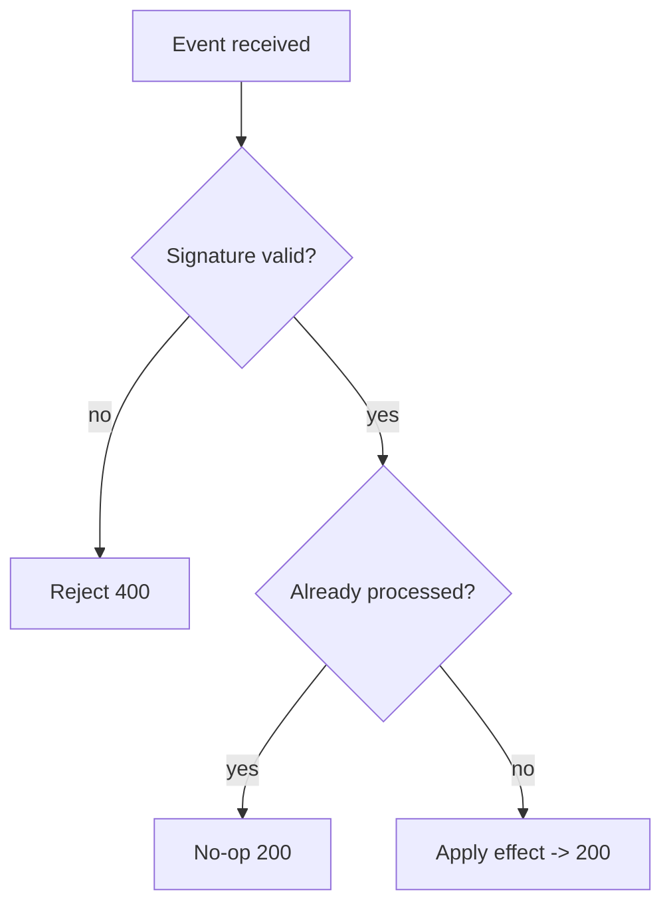
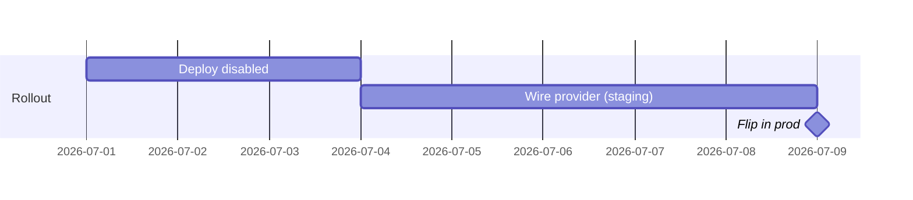

# Diagrams as code (Mermaid) — catalog

Diagrams live **inside the doc** as Mermaid fenced code blocks. They version with
the doc, diff in PRs, render on GitHub/GitLab/VS Code/most Markdown viewers, and
need no draw.io, Lucidchart, or exported PNGs. This is the catalog: which diagram
for which job, a copy-paste snippet for each, and the rules that keep them clean.

> Render check: GitHub and VS Code (with the Markdown Preview Mermaid extension)
> render these natively. A broken Mermaid block shows as a render error — worse
> than no diagram — so **always preview before committing.**

## Pick the right diagram

| You need to show… | Use | Why |
|---|---|---|
| System parts + who talks to whom | `flowchart` | boxes + labelled arrows; subgraphs = trust boundaries / zones |
| One interaction over time (a request) | `sequenceDiagram` | actors + ordered messages; `autonumber` for reference |
| A lifecycle / status field | `stateDiagram-v2` | states + transitions; shows terminal states |
| A data model | `erDiagram` | entities, attributes, cardinality |
| Architecture at scale | C4-as-`flowchart` | nest subgraphs for context→container→component |
| A real timeline / plan | `gantt` | only when dates/sequence genuinely matter |
| A decision tree / branching logic | `flowchart` with diamonds | `{cond?}` nodes |

## Rules (the difference between clarifying and cluttering)

- **One idea per diagram.** If decoding it needs a paragraph, split it.
- **Label every arrow** with the verb/payload (`-->|signed webhook|`).
- **Short node text**, detail in the prose. Nodes are landmarks, not paragraphs.
- **Mark boundaries** (trust zones, services, network edges) with `subgraph`.
- **Show terminal states** in lifecycles; note if transitions are monotonic.
- **Don't diagram the trivial** — a 3-step linear flow is a sentence.

---

## Snippets

### System context / data flow — `flowchart`

`-->` solid call, `-. text .->` async/callback, `[(...)]` datastore, `subgraph`
a boundary. Direction: `LR` (left-right) reads best for request flows, `TB` for
hierarchies.

### Interaction over time — `sequenceDiagram`

`->>` request, `-->>` response, `loop`/`alt`/`opt` for control flow, self-message
for internal steps. `autonumber` lets prose cite "step 6".

### Lifecycle — `stateDiagram-v2`

`[*]` = start/terminal. Note in prose whether transitions are monotonic (no
going back) — reviewers check that a terminal state can't be downgraded.

### Data model — `erDiagram`

Cardinality: `||` exactly one, `o{` zero-or-many, `|{` one-or-many. Put only
key/clarifying attributes in the block; the full field table goes in prose.

### Architecture at scale — C4 as nested `flowchart`

C4's value is **levels**: a context diagram (system + neighbors), then a
container diagram (apps/services/stores inside it), then component diagrams per
container. Keep each level its own diagram; don't cram three levels into one.

### Decision / branching — `flowchart` with diamonds

### Timeline — `gantt` (use sparingly)

Only when the temporal sequence is the point. For dependency-ordered work that
isn't calendar-bound, a numbered list or a `flowchart` is clearer.

---

## Mermaid gotchas

- **Quote labels with special chars** (`/`, `:`, `(`, `?`, `#`): `A["GET /x?y"]`.
- **`stateDiagram-v2`**, not the legacy `stateDiagram`, for transition labels.
- **No raw `<`/`>`** in node text — they parse as HTML; spell them out or quote.
- **Keep one diagram per fenced block**; don't nest fenced blocks.
- **Long flows**: prefer two linked diagrams over one unreadable giant.
